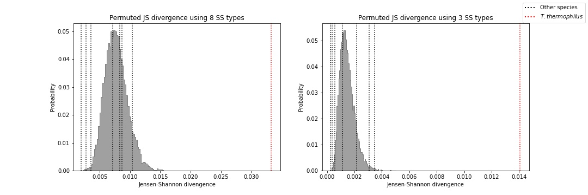
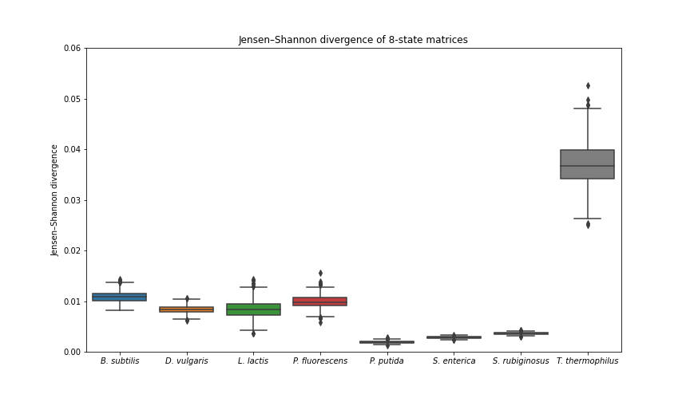
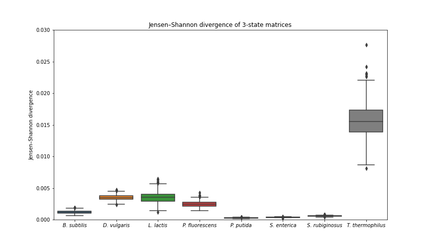
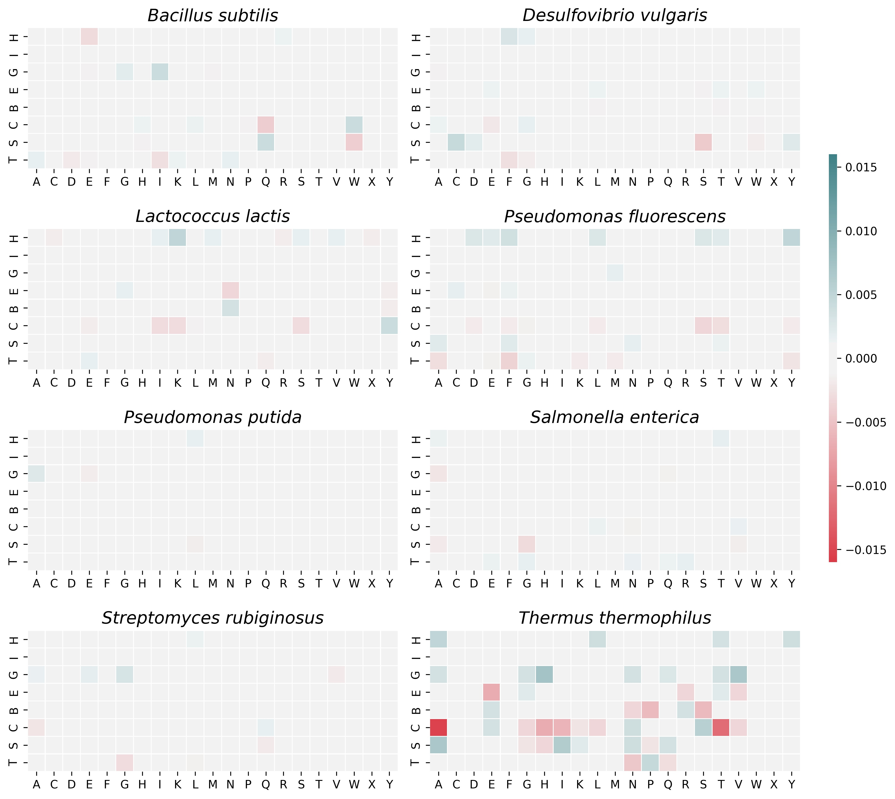
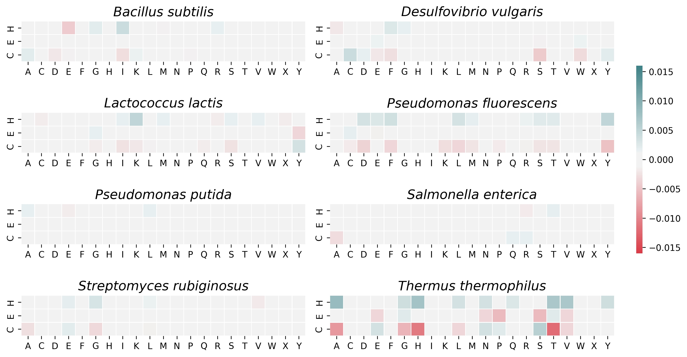

# Abstract

Majority of protein structure studies use *Escherichia coli* and other model organisms as expression systems for other species’ genes. Data from those studies are used as training and validation sets for structure prediction models as well as for other research purposes. At the same time, protein folding depends on cellular environment factors, such as chaperone proteins, cytoplasmic pH, temperature, and ionic concentrations. Because of differences in these factors, especially temperature and chaperones, native proteins in organisms such as extremophiles may fold improperly when they are expressed in mesophilic model organisms. Here we present a methodology of assessing the effects of using *E. coli* as expression system on protein structures. We compare these effects between eight mesophilic bacteria and *Thermus thermophilus*, a thermophile, and found that differences are significantly larger for *T. thermophilus*. More specifically, helical secondary structures in *T. thermophilus* proteins are often predicted as coil structures in *E. coli*. Our results show unique directionality in misfolding when proteins in thermophiles are expressed in mesophiles. This indicates that extremophiles, such as thermophiles, require unique protein expression systems in protein folding studies.

**Key Words:** *recombinant protein folding, protein secondary structure, extremophile bacteria*

# Order of procedure:

1) **Data preprocessing** - we use PDB's [ss.txt](https://cdn.rcsb.org/etl/kabschSander/ss.txt.gz) file to create a csv file with AA and SS sequences in a table format for all available entries
2) **FASTA files creation** - using [PDB](https://www.rcsb.org/) or [ePDB](https://www.ebi.ac.uk/pdbe/node/1) advanced search, we found IDs of each protein source / expression system pair and saved the results in .csv format. An [example](examples/00_example_IDs.csv) of such file is provided. We combine the .csv files with the preprocessed SS_data_processed datafile (d_processed) to obtain AA of these entities and save them in .FAS format. Separate files are made for *E. coli* and "native" expression systems
3) **BLASTp** - this step is performed in [DAMBE](http://dambe.bio.uottawa.ca/DAMBE/dambe.aspx). We used "native" AA files to create BLAST databases and *E. coli* files as queries
    1. Merge duplicate sequences in "native" AA files - the BLAST databases cannot have duplicates. An [example](examples/02_example_AA_unique.FAS) of such file is provided.
    2. Create BLAST database files using [DAMBE](http://dambe.bio.uottawa.ca/DAMBE/dambe.aspx) or use our files from [BLAST databases](BLAST_databases/) folder.
    3. Run BLASTp and save results as .csv ([examle](examples/04_example_BLAST.csv))
5) **BLASTp results filtering** - we load the results of BLASTp and filter them
6) **Data files creation** - we use filtered BLASTp results to create a separate data file for each protein database. Each Protein origin species / Expression system pair has a separate database
7) **Matrix creation** - for each resampled data file we create a count matrix with AA / SS pairs
8) **Matrix comparison** - matrices are compared visually and JS divergencies are calculated between them
9) **Statistical analysis** - we compare JS divergencies between different data files. We obtain median JS divergencies to compare effect of having *E. coli* as an expression system for proteins from different source organisms. We use bootstrapping to obtain confidence intervals and permutation to test null hypothesis that JS divergencies are not correlated with protein source species

The notebook can work in one session or in multiple sessions with intermediate files being saved and loaded into the notebook later to continue from the same point.

# Our results:
**JSD permutation results**

**JSD boxplots**
1) 8-SS:

2) 3-SS:

**Heatmaps of SS changes**
1) 8-SS:

2) 3-SS:

