# Abstract

In addition to amino acid sequence, protein folding in cells depends on cellular environment factors, such as chaperone proteins, cytoplasmic pH, temperature and ionic concentrations. This means that different organisms with dissimilar cellular environments, such as extremophiles, may not have the native protein structures when they are expressed in mesophilic model organisms, such as *Escherichia coli*. Protein secondary structure identification methods regularly do not have these interspecific differences taken into consideration. As a result of that, known secondary structures determined for proteins from diverse organisms are often used for predictive methods training. Moreover, many protein structure studies use *E. coli* and other model organisms as expression systems for other species’ genes without considering potentially different cellular protein-folding environments. In order to assess the effect of species-specific factors, we analyzed protein folding in different cellular environments. During this study separate count matrices were created using structures of proteins with *E. coli* as expression system and compared with those with expression systems same as protein source organisms. Differences between count matrices from different models were quantified using Kullback–Leibler divergence. The two *Thermus thermophilus* matrices had larger and more variable divergencies between them than those of non-thermophilic species. Moreover, we found directionality in this distance as helical secondary structures were more likely to form in *T. thermophilus* as expression system than in *E. coli*, where coil structures were formed instead. Our results suggest that extremophile protein source organisms should be used as protein expression systems in structural studies due to protein folding dependence on species-specific factors, such as environmental conditions and / or chaperone activity.

**Key Words:** *protein folding, protein secondary structure, chaperones, extremophile bacteria*

**This repository contains scripts used in the analysis, examples of files used and our results**

# Order of procedure:
1) **Download [data](https://cdn.rcsb.org/etl/kabschSander/ss.txt.gz) from PDB.** This is a text file with chain IDs, amino acid sequences and secondary structure sequences for all residues available on PBD.
2) **Replace all " " in data file with "C".** PDB file has " " in positions with no stable structures (or coils). We replace these empty spaces with "C" so that later procedures work better and recognize the coil structueres properly.
3) **Run the [colab notebook](scripts/SS_and_expression_systems_v1.ipynb) with the scripts.** This file contains information on how it works. In case that the first step (data preprocessing) takes too long, you can use [00_data_processing](scripts/00_data_processing.py) script instead and load the resulting file into the notebook on the next stage. The 00_data_processing script requires 3 arguments:
    1. Path to your ss.txt file
    2. Path to your output csv file
    3. Number of lines in your ss.txt file. The file is large, so it is better to input it manualy.

The notebook can work in one session or in multiple sessions with intermediate files being saved and loaded into the notebook later to continue from the same point. Examples of the intermediate files are available in the [examples](examples) folder.

# Our results:
**KLD boxplots**
1) 8-SS:

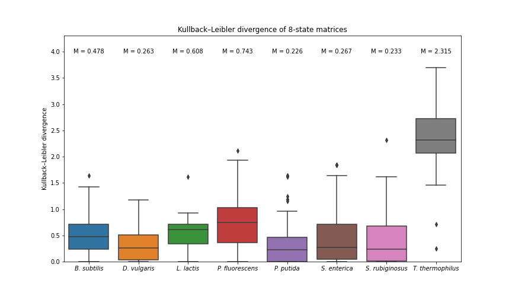

2) 3-SS:

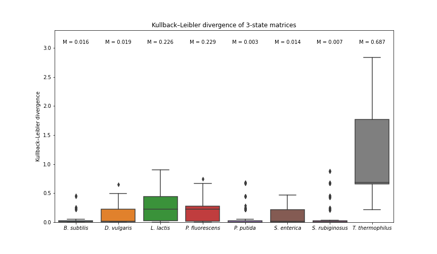

**Heatmaps of SS changes**
1) 8-SS:

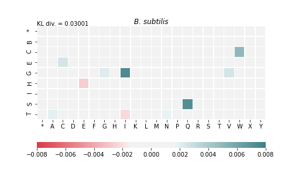
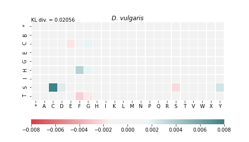
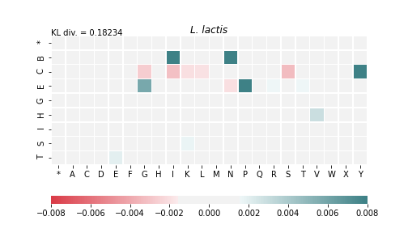
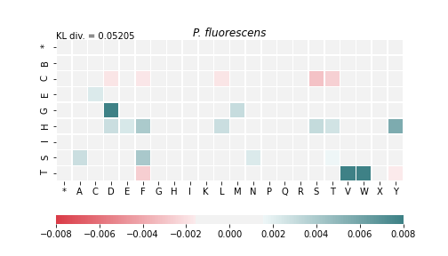
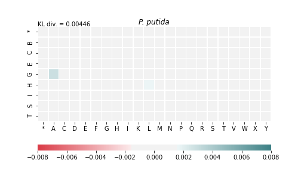
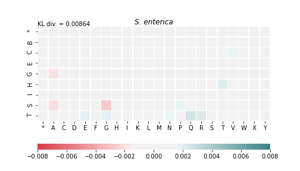

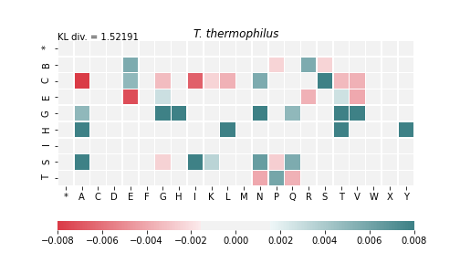

2) 3-SS:

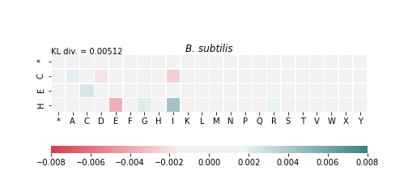
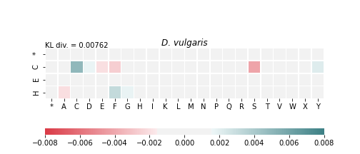
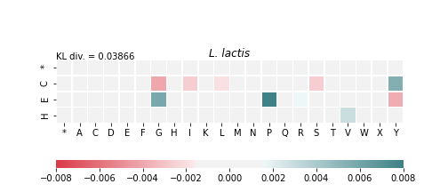
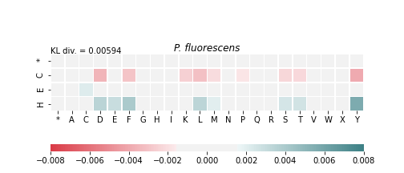
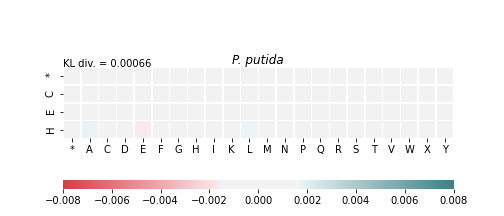
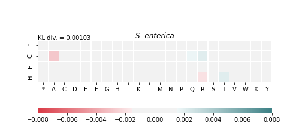
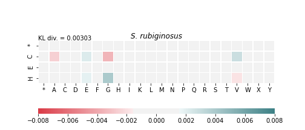
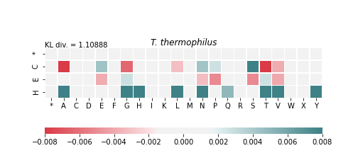
